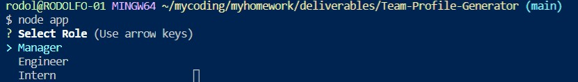

# Team-Profile-Generator

MIT 

## About this application:
`Node.js` Command-line application to create a software development team roster.

## Table of contents:
* [Team Profile Generator](#team-profile-generator)
* [About](#about-this-application)
* [Usage](#usage)
* [Installation](#installation)
* [License](#license)
* [Testing](#special-testing-instructions)
* [In case of Questions](#in-case-of-questions)
* [Link to video](#link-to-video)

## Usage:
This `Node.js` application can be used by any one who would like to save time and keep themselves well organized by creating a dev team roster with names IDs and contact information.

A command line prompt will guide the user thru a series of questions that will populate the roster with three different employee categories to choose between a Manager, Engineer and Intern.

Once all questions are answered and the user decides there are no more persons to add to the roster, an HTML file is generated and stored under the output folder that is also generated.

---
- Here it is an example of the questions prompted when the application is started with a list of the three categories:
    

- When all questions are completed.
    

- This is an example of the written file once the program is completed. 
    
---
## Installation:
The application requires `inquirer` ,`fs`, and `util` node packages. 
Run `npm install inquirer` and `npm install util` before executing `node app.js`

## License
I have used the MIT license for this application see repository documentation 
<https://github.com/Rodolfod1/Team-Profile-Generator/blob/main/LICENSE>

## Testing
This can be manually tested or using any test tool

## Link To Video demonstrating the app:
  
<https://drive.google.com/file/d/1Y7SwBe2zHc9cNLgpLKeXsj5xpUrExsnk/view>

## In case of questions:
Please contact me at my e-mail: 
rodolfodzr@gmail.com

Follow me on Github
<https://github.com/Rodolfod1>